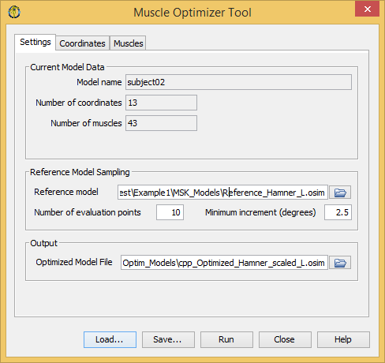
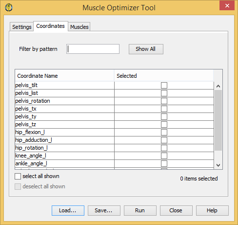
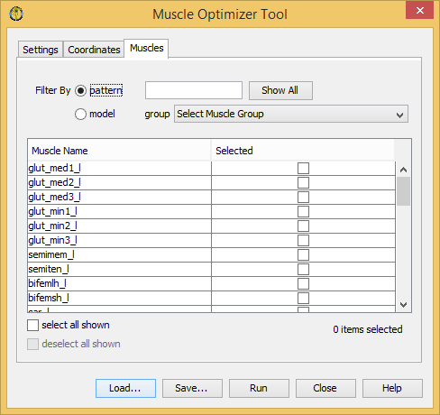

.. _MOguiplugin:

GUI plugin for OpenSim 3.3
##########################

To launch the Muscle Optimizer Tool plugin (after it has been installed following :ref:`installMO`),
select ``Tools -> Muscle Optimizer Tool...`` from the OpenSim main menu bar.

.. _figMOmain:

   Muscle Optimizer Tool main window

The Muscle Optimizer Tool window (figure :ref:`figMOmain`), like all other OpenSim tools, operates on the current model. The name of the current model is shown in bold in the Navigator window.
Any model can be made the current model by right-clicking on its name and selecting Make Current. See the `OpenSim documentation
<http://simtk-confluence.stanford.edu:8080/display/OpenSim/Opening%2C+Closing%2C+and+Using+the+Navigator+Window>`_
for information on opening models and making a particular model current.

The *Settings* pane is used to specify the reference and output models, and parameters related to the
sampling procedure. The *Coordinates* pane is used to select the coordinates to consider, while the
*Muscles* pane is used to select the muscles to process.

The Control Panel
=================

.. _figMOcp:

   Tool control panel

As for all OpenSim tools, at the bottom of the dialog window are five buttons,
located in what is called the Control Panel (fig. :ref:`figMOcp`).

  - The ``Load`` and ``Save`` buttons are used to load or save settings for the tool.
  - The ``Run`` button starts execution.
  - The ``Close`` button closes the window.
  - The ``Help`` button takes you to the online User Guide.

.. note::

  Note that the ``Close`` button can be clicked immediately after execution has begun; the execution will complete even though the window has been closed.

If you click ``Load…``, you will be presented with a file browser that displays all files ending with the .xml
suffix. You may browse for an appropriate settings file (e.g., setup_MO_example1.xml) and click ``Open``.
The tool will then be populated with the settings in that setup file.
If you have manually entered or modified settings, you may save those settings to a file for future use. If
you click ``Save…``, a Save dialog box will come up in which you can specify the name of the settings file.
The name you specify for the file should have a suffix of .xml. Click ``Save`` to save the settings to file.

Settings Pane
=============

The *Settings* pane (figure :ref:`figMOmain`) is used to specify the reference and output models,
and parameters related to the sampling procedure.
The pane is organized into three main sections: `Current Model Data`_, `Reference Model Sampling`_ and `Output`_.

Current Model Data
------------------

The section for Current Model Data displays uneditable information about the current model. It gives the model name, and the number of coordinates and muscles. Ideally, the reference model specified in `Reference Model Sampling`_ should match the current model in terms of coordinates and muscles (at least, for the muscles and coordinates that are enabled, see `Coordinates Pane`_ and `Muscles Pane`_).

Reference Model Sampling
------------------------

The Reference Model Sampling section allows to select the reference model and determine how its operative range is sampled.
In the text box to the right of *Reference model* you can enter the location of an OpenSim (.osim) model file to use as reference,
or you can fill in the information by browsing to the correct file, after clicking the folder icon to the right.
In the text boxes below it is possible to enter the number of evaluation points that are considered per degree of freedom, and the minimum degree increment that is allowed between two consecutive points. This might reduce the actual number of evaluation points that are considered on coordinates with a small range.

Output
------

When you run the Muscle Optimizer tool, an optimized model will be created and added to the Navigator window in OpenSim; if you also want to save the model to a file on the disk, you can specify the output file name. You can click on the *folder* icon to open a file browser that allows you to choose a location for the output file.

Coordinates Pane
================

.. _figMOcoord:

   Coordinates pane

The Coordinates Pane presents a list of the coordinates available in the current model.
It is possible to enable a coordinate by checking the corresponding checkbox in the *Selected* column.
If you want to enable/disable multiple coordinates more easily, you can filter the list by typing a pattern
in the *Filter by pattern* text box. Shortening the list by using the filter does not change the *selected*
attribute for elements that are not shown.
You can show all the names available for selection by pressing the ``Show All`` button.
For more information on how the pattern search works, please refer to the `OpenSim documentation
<http://simtk-confluence.stanford.edu:8080/display/OpenSim/Selection+Filtering+Window#SelectionFilteringWindow-_Toc194684314PatternFiltering>`_.

.. note::

  It is not possible to disable all model coordinates. If no coordinates are selected, all coordinates will be taken into consideration.

Muscles Pane
============

.. _figMOmusc:

   Muscles Pane

The Muscles Pane presents a list of the muscles available in the current model.
It is possible to enable a muscle by checking the corresponding checkbox in the *Selected* column.
It is possible to reduce the list by filtering the elements by pattern search or by muscle group,
as in `OpenSim's plotter tool
<http://simtk-confluence.stanford.edu:8080/display/OpenSim/Selection+Filtering+Window>`_.

.. note::

  It is not possible to disable all model muscles. If no muscles are selected, all muscles will be processed.
