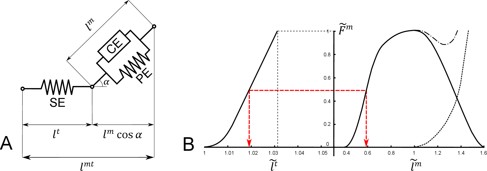
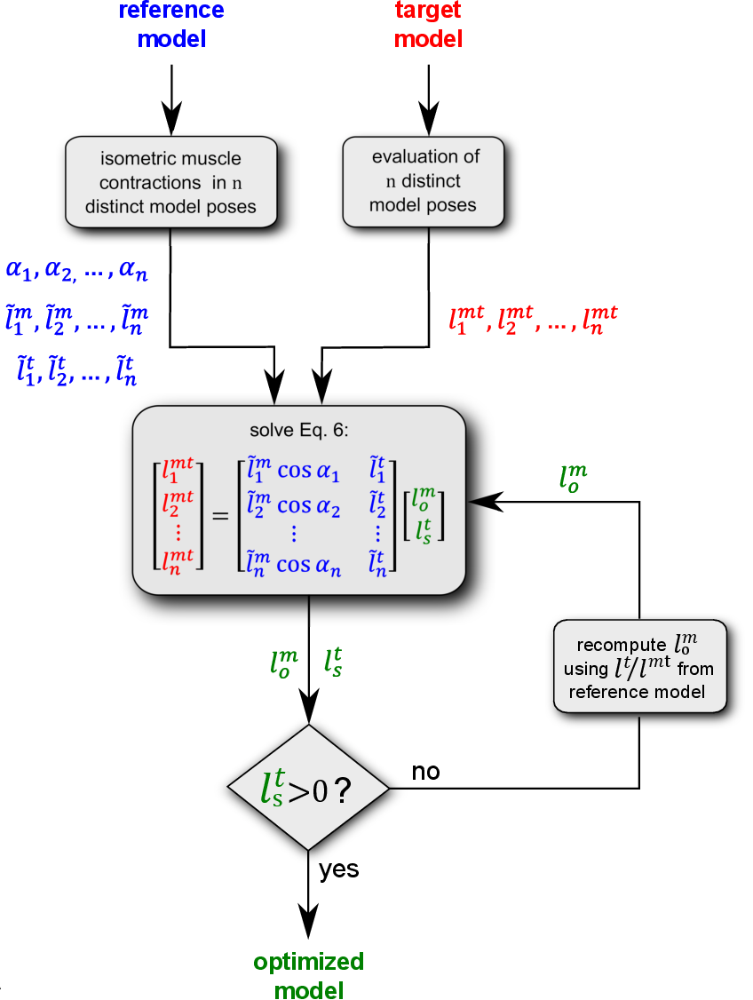

Muscle Optimizer Theory
=======================

.. _moOverview:

Overview
--------

Musculoskeletal modeling is a computational technique that allows simulating human motion and estimating internal joint loads
and muscle forces. The aim is to gain deeper insight on the forces occurring in the human body.
Simulations can be created using generic models derived from cadaveric data or using personalized models
of the musculoskeletal geometry built from medical images.

However, these personalized models are currently challenging to generate because, while personalized bone geometries and
joint parameters can be obtained from segmentation of medical images, musculotendon parameters that regulate force generation
currently cannot be easily measured or estimated. This is especially true for the optimal fiber length :math:`l_o^m` and tendon slack length :math:`l_s^t`.

The algorithms available in the literature to estimate these parameters can be divided into "anthropometric" and "functional" approaches,
depending if they use as input only skeletal dimensions or integrate those with additional measurements of muscular function.

The anthropometric algorithm implemented in the Muscle Optimizer toolbox maps the muscle fiber operating ranges of a generic model into a scaled model, similarly to :cite:`Winby20081682`,
but using a generic and efficient implementation. Musculoskeletal models to be optimized, computational muscle models and involved degrees of freedom are fully customizable by the user.

Theory
------

Dimensionless muscle model
^^^^^^^^^^^^^^^^^^^^^^^^^^

The Muscle Optimizer toolbox works on OpenSim :cite:`delp2007opensim` models including dimensionless Hill-type muscle actuators of the kind proposed by Zajac in :cite:`zajac1989muscle` (:numref:`fighillmuscle`).
These models include a contractile element (CE) connected to an elastic element in series (SE) and one in parallel (PE) and use normalized functions
to define the active and passive muscle force-length curves, force-velocity curve and tendon force-strain curve. They need five parameters to be defined:
optimal fiber length :math:`l_o^m`, tendon slack length :math:`l_s^t`, maximum fiber isometric force :math:`F_{iso}`., pennation angle at optimal fiber length :math:`\alpha_o` and maximum contraction velocity :math:`v_{max}`.
Equilibrium of the musculotendon unit is obtained when the tendon and the fiber forces along the tendon direction are equal.

.. _fighillmuscle:

   Hill muscle model: A) Representation of the three elements Hill-type muscle model assumed by the software. B) Generic curves defining the dimensionless material properties of the tendon (left side, dashed line identifying tendon stretch for which tensile force equals maximum isometric force) and muscle (right side, solid line: active force, dashed line: passive force, dash-dot line: total muscle force). An equilibrated contraction of a non-pennate muscle is also represented (red dashed line).

Describing the dimensionless muscle operating range
^^^^^^^^^^^^^^^^^^^^^^^^^^^^^^^^^^^^^^^^^^^^^^^^^^^
The entire operating range and isometric force generating
modalities of a muscle can be described by its normalized coefficients calculated as a function of the joint angles
spanned by the muscle in the model. In this toolbox, we tackled this problem following the procedure described in our
recent paper :cite:`modenese2016estimation` and reported below.

The length of a musculotendon actuator :math:`l^{mt}` can be calculated from the muscle length :math:`l^m` and tendon length :math:`l^t` as follows (:numref:`fighillmuscle` A):

.. math:: l^{mt} = l^m \cos\alpha + l^t
   :label: mtu_length

where :math:`\alpha` is the pennation angle at that specific muscle length, calculated assuming constant muscle thickness, as:

.. math:: \alpha = \arcsin(\frac{l_o^m \sin \alpha_o}{l^m})
   :label: penn_angle

Following :cite:`zajac1989muscle` we defined the normalized fiber length as:

.. math:: \tilde{l}^m = \frac{l^m}{l^m_o}
   :label: norm_fib_len

and we decided to define a normalized tendon length (:math:`\epsilon^t`  being tendon strain) as:

.. math:: \tilde{l}^t = \frac{l^t}{l^t_s}=(1+\epsilon^t)
   :label: norm_ten_len

Using normalized coefficients, the musculotendon length can now be expressed as :math:`f(l_o^m, l_s^t)`:

.. math:: l^{mt} = (\tilde{l}^m \cos\alpha)l_o^m + \tilde{l}^t l^t_s
   :label: mtu_length_norm

If the normalized coefficients are calculated from :math:`l^m` and :math:`l^t` in a musculotendon unit equilibrated
for isometric contraction at maximum activation, Eq. :eq:`mtu_length_norm` ensures static equilibrium between the
tendon and (active plus passive) muscle force of any muscle actuator of length :math:`l^{mt}` whose :math:`l_o^m` and
satisfy that equation. For an example, see :numref:`fighillmuscle` B.

Musculotendon parameters estimation
^^^^^^^^^^^^^^^^^^^^^^^^^^^^^^^^^^^
.. _figworkflow:

   Flowchart from :cite:`modenese2016estimation` representing the main steps of the proposed algorithm for estimating the parameters of each musculotendon unit (blue: reference model, red: target model, green: optimized model).

Similar to :cite:`Winby20081682`, the proposed method aims to map the normalized muscle operating conditions of an existing “reference model”,
whose muscle parameters are assumed to be physiologically valid, onto a “target model” of different anthropometric dimensions for equivalent
joint configurations. The algorithm, represented as flow chart in :numref:`figworkflow` A, consists of the following steps, applied to each muscle included in the model:

1. In the reference model, the :math:`N_q` degrees of freedom spanned by the musculotendon actuator are uniformly sampled using :math:`n_{dof}` points per coordinate, so generating a set of :math:`n=(n_{dof})^{N_q}` total model poses in which the considered muscle is equilibrated for isometric contraction with a unitary activation.

2. For each pose :math:`i=1,2,...n` of the reference model, the vectors of pennation angles :math:`\alpha_{i,ref}`, normalized fiber lengths :math:`\tilde{l}^m_{i,ref}` and normalized tendon lengths :math:`\tilde{l}^t_{i,ref}` are calculated using Eqs. :eq:`penn_angle` :eq:`norm_fib_len` :eq:`norm_ten_len`. Normalized fiber lengths outside the range of 0.5 and 1.5 or causing pennation angles approaching 90 degrees are excluded.

3. The musculotendon lengths :math:`\alpha_{i,ref}` are calculated in the target model for the same joint configurations used in the reference model at step 1.

4. Imposing Eq. :eq:`mtu_length_norm` for all poses, the following :math:`n \times 2` linear system is obtained and can be solved in a least square sense, so obtaining the unknown values of :math:`l^m_{o,targ}` and :math:`l^t_{s,targ}`.

.. math:: \begin{bmatrix} l_1^{mt} \\
                          l_2^{mt} \\
                          \vdots \\
                          l_n^{mt}
          \end{bmatrix}_{targ} =
          \begin{bmatrix} \tilde{l}_1^m\cos{\alpha_1} & \tilde{l}_1^t \\
                          \tilde{l}_2^m\cos{\alpha_2} & \tilde{l}_2^t \\
                          \vdots \\
                          \tilde{l}_n^m\cos{\alpha_n} & \tilde{l}_n^t
          \end{bmatrix}_{ref}
          \begin{bmatrix} l_o^m \\
                          l_s^t
          \end{bmatrix}_{targ}
   :label: ls_system

5. If the system yields non physiological results, such as  :math:`l^t_{s,targ}<0`, the tendon fraction of :math:`l^mt_{targ}` is
temporary fixed at the same proportion of the reference model :math:`l^m_{o,targ}` estimated by solving Eq. :eq:`ls_system` and
finally :math:`l^t_{s,targ}` is re-computed from the same equation using the new value of :math:`l^m_{o,targ}`.

.. only:: html

    .. rubric:: Bibliography

.. bibliography:: literature.bib
   :cited:
   :style: unsrt

